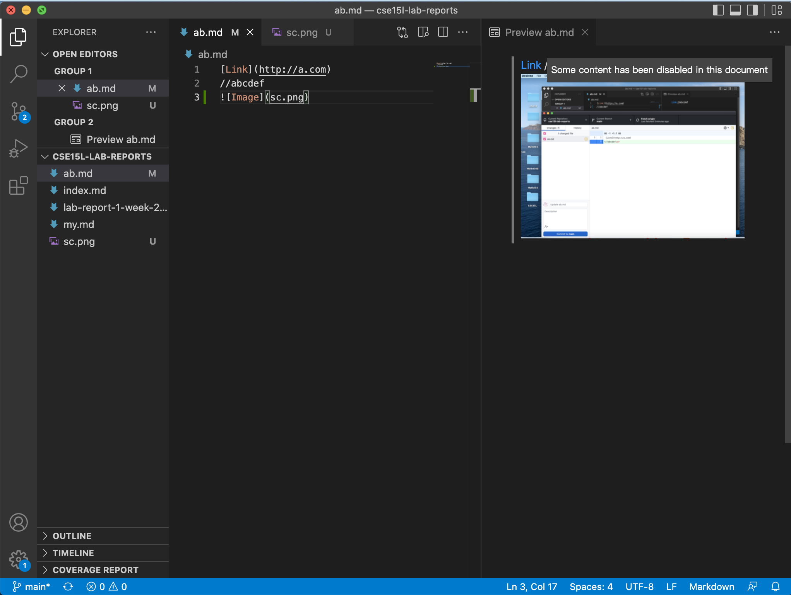
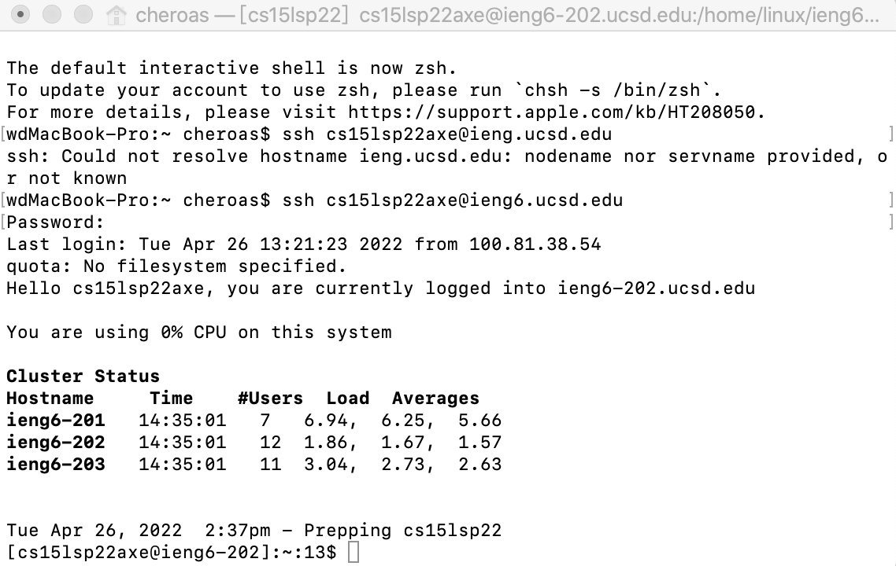
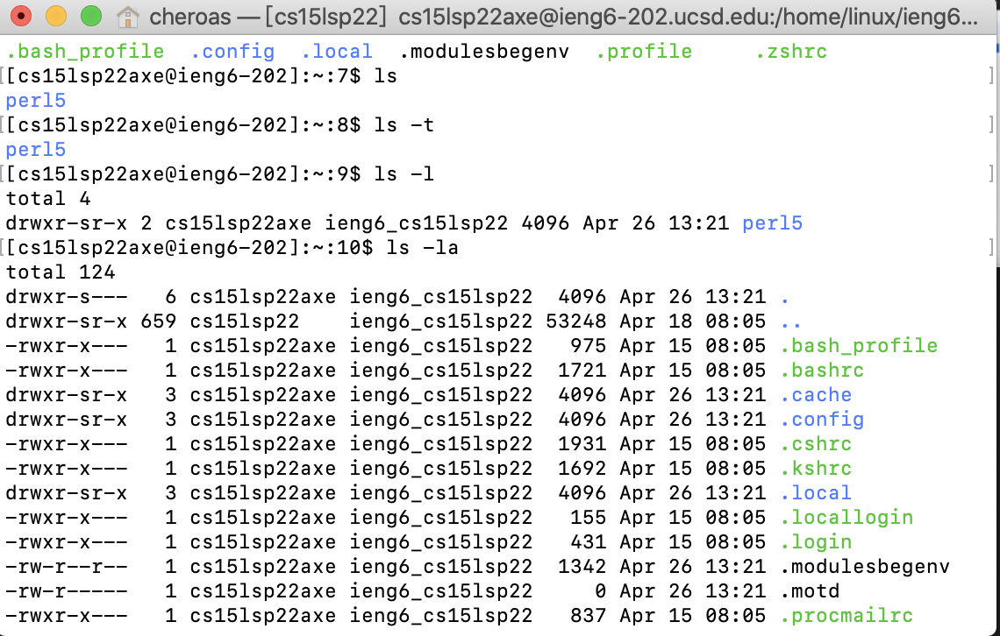
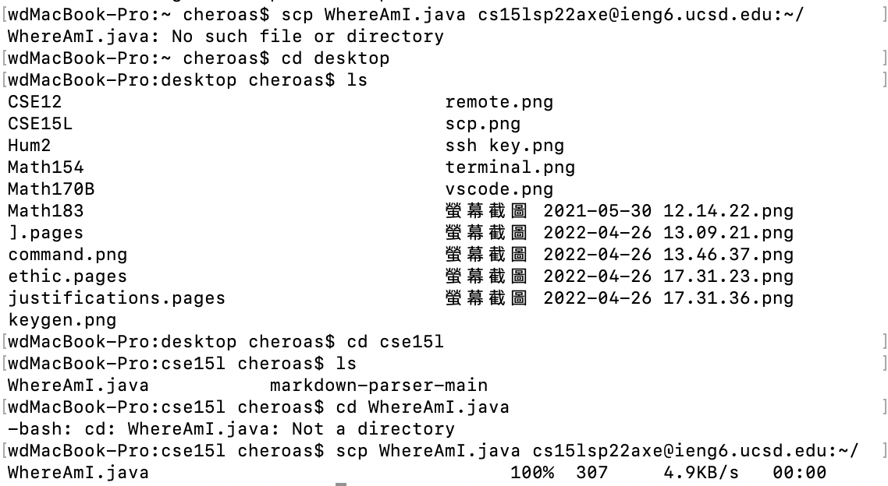
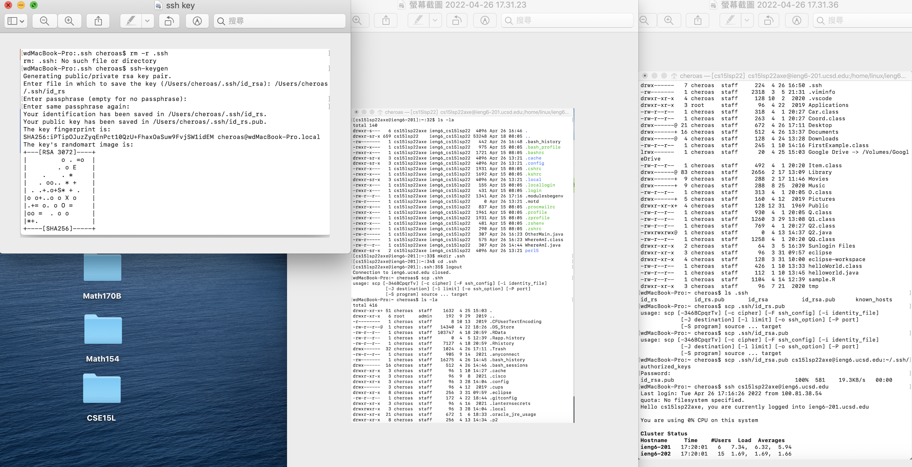
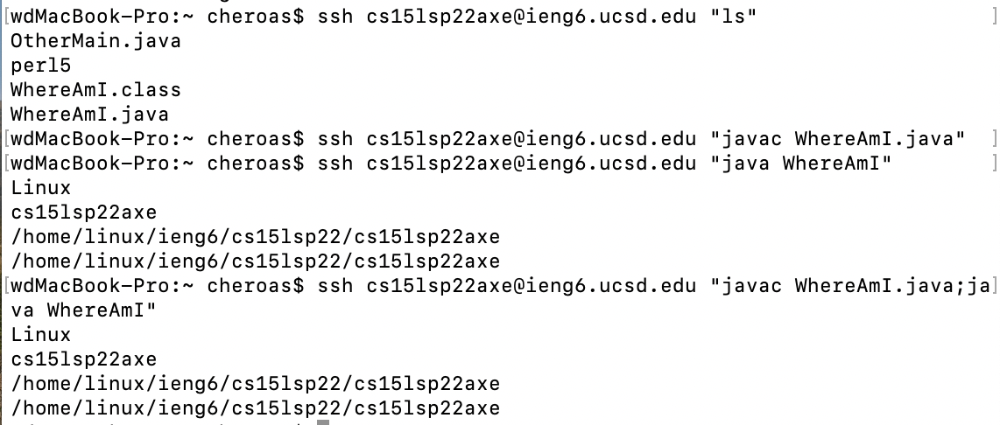

# Installing VScode:
 I installed the vs code by clicking a link of their website. Then a document is in my download and I just opened it and install it. 
# Remotely Connecting: 
I usd `ssh  cs15lsp22axe@ieng6.ucsd.edu` which includes my own account name and ucsd to be connected remotely. 
# Trying Some Commandsz: 
I tried `ls`, it made me see the files on my computer. Then `ls -la`, it shows more specifically with time and `ls -lat` it shows those files order by time. 
# Moving Files with scp: 
At first, my file was not on the right directory. So I use the command `cd` with the file name and direct to the correct file step by step. 
# Setting an SSH Key: 
I remove .ssh from the remote account and then use `ssh-keygen` command and add it in my local account. Then I use `mkdir .ssh` to make directory to the remote account and then log out my account. Then I used `scp` to copy the file from remote to my computer. And put public inside so that I don't need to enter password anymore. 
# Optimizing Remote Running: 
I used `ssh cs15lsp22axe@ieng6.ucsd.edu "ls"` instead of `ssh cs15lsp22axe@ieng6.ucsd.edu` then use `ls` command. And it save more time. What's more, to complie and run the WhereAmI.java efficiently, I put javac and java toghter in one line and separate those with";". It make me save more time on running these code. 
