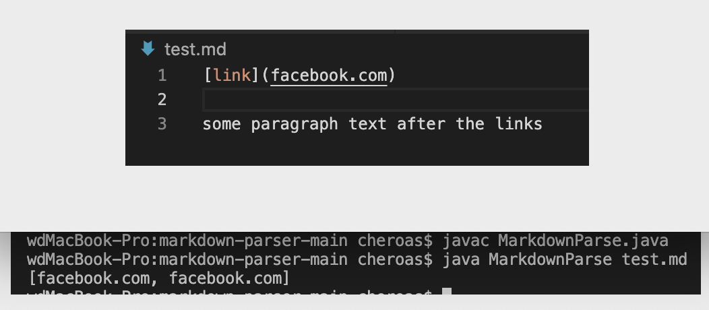

# code change diff

# failure input1
[link](https://github.com/lejiaz/markdown-parser-lab3/blob/main/test-file.md)
# output with symptom1

# Relationship1
 It only shows one line which is "http://something.com". So there is an error. In order to show the missing line, we can create a if statement in the while loop including current index and old current index and also show their relationship. And then "break". Then it becomes ok. Since the code is not complete in some way, the symptom happened.
# failure input2
[link](https://lejiaz.github.io/markdown-parser-lab3/test.html)
# output with symptom2

# Relationship2
The input didn't show one line about what it should be because the relationship of current index and old current index are not carified.And we are not able to break. The symptom is that the output running twice which was supposed to be once. And the bug is that the test link shows twice. The bug causes the symption.
# failure input3
[link](https://github.com/lejiaz/markdown-parser-lab3/blob/main/test2.md)
# output with symptom3

# Relationship3
It shows the first line of the test link twice and the link comes after the second image. It's also caused by the error in the code. We need to add a remove command to the while loop in the if loop. Then the output is able to show correctly.