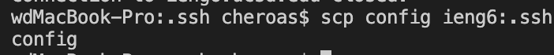
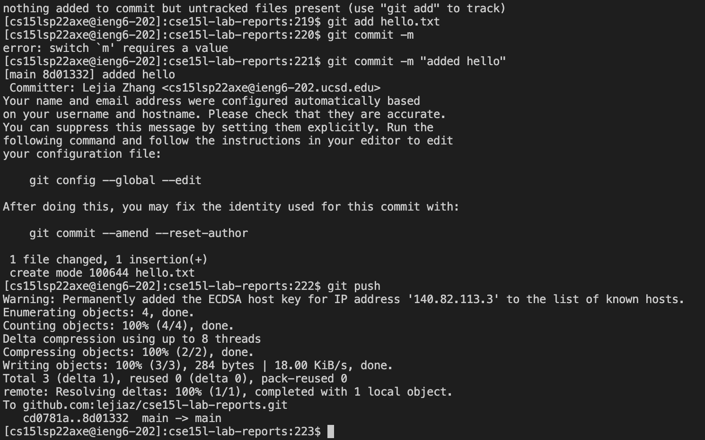

# Streamlining ssh Configuration
my .ssh/config file

how I edit it

command log in

show scp command

# Setup Github Access from ieng6
public key on Github and in user account

keygen

git commit
[link](https://github.com/lejiaz/cse15l-lab-reports/commit/8d01332e2c752e506d151fd240d38304ec40b924)

# Copy whole directories with scp -r

`scp -r *.java *.md lib/ <hostname>:markdown-parse`

in one line:
`ls; cd markdownmarkdown-parser-main/; javac -cp .:lib/junit-4.13.2.jar:lib/hamcrest-core-1.3.jar MarkdownParseTest.java; java -cp .:lib/junit-4.13.2.jar:lib/hamcrest-core-1.3.jar org.junit.runner.JUnitCore MarkdownParseTest;`

We can run multiple commands in one line using the `;` operand we will `scp` and `ssh` and run all in one go

`scp -r *.java *.md lib/ school:~/markdown-parse; ssh school "cd markdown-parse; /software/CSE/oracle-java-se-14/jdk-14.0.2/bin/javac -cp .:lib/junit-4.13.2.jar:lib/hamcrest-core-1.3.jar MarkdownParseTest.java; /software/CSE/oracle-java-se-14/jdk-14.0.2/bin/java -cp .:lib/junit-4.13.2.jar:lib/hamcrest-core-1.3.jar org.junit.runner.JUnitCore MarkdownParseTest"`

