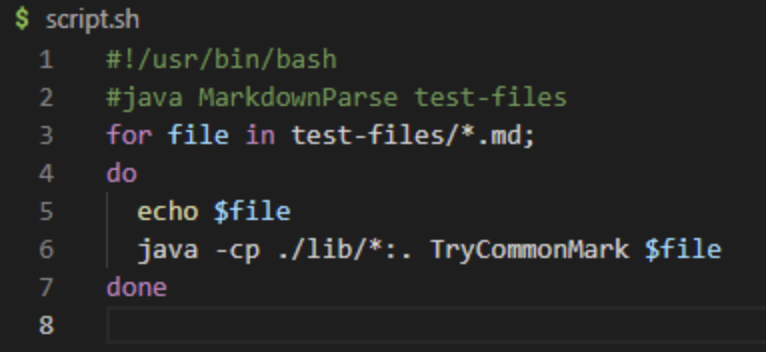
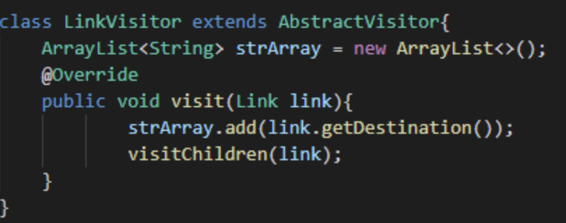
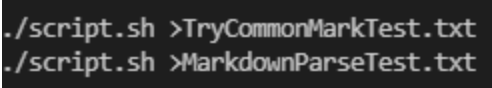
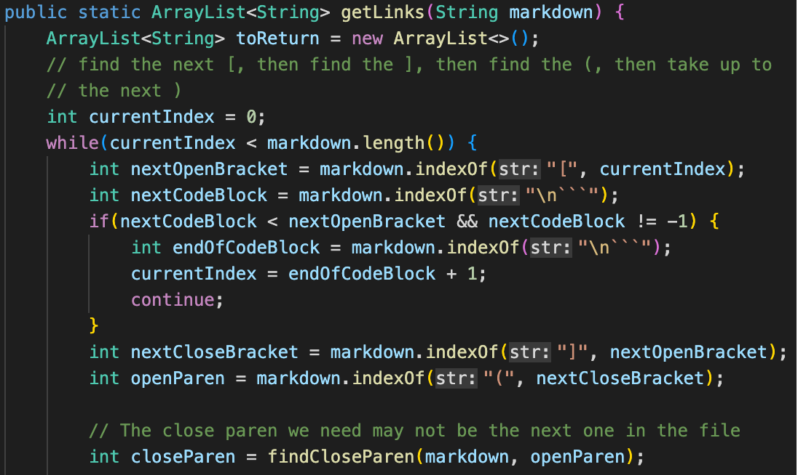
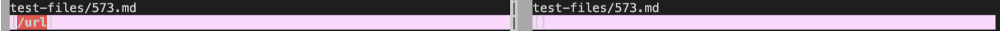
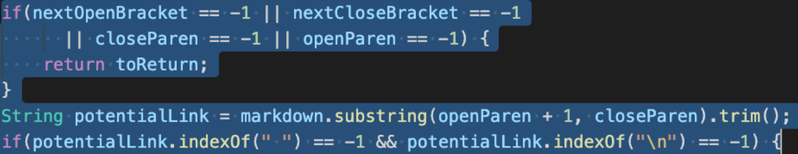

# How found the tests with different results
I used the script to iterate through all files with the trycommonmark file. I edited the trycommonmark by adding a new class link visitor to visit each link.

added the greater sign and a text file so that all the files can be added into seperate text file. and it manually compare the two codes.

Given code

The given program returns incorrect link. The expected returning output should be  the CommonMark demo.

# Test 573
[link](https://github.com/nidhidhamnani/markdown-parser/blob/main/test-files/573.md)

this is the given output vs mine. The output was supposed to be `[]`.

the code should check open barket after checking the double brankets. To make sure the search go on, currentIndex should be updated to be `closeParen - 1`.

# Test 481
[link](https://github.com/nidhidhamnani/markdown-parser/blob/main/test-files/481.md)
this is the given output vs mine. The output was supposed to be `[]`.

it returns incorrect link and this part cause error. The given code is incorrect because it doesn't return an empty array. I am assuming if there is a ctrl click option for the text, the commonmark code will think it is a link and puts in in.
